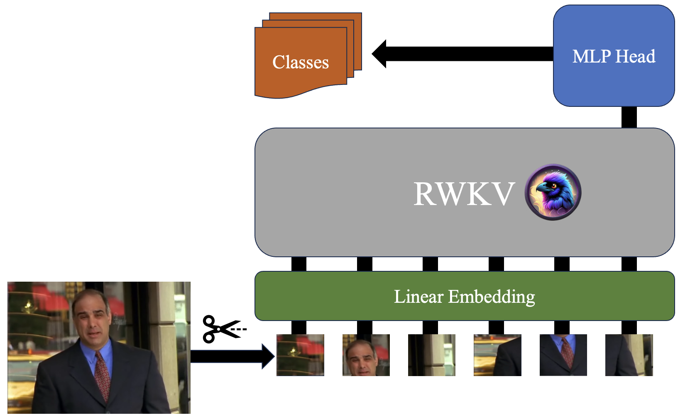

# Facial Expression Recognition with RWKV Architecture

## Introduction
This repository contains an implementation for facial expression recognition using RWKV architecture on the CAES-R dataset. Our approach focuses on utilizing RWKV mechanisms for sequence processing, providing an innovative solution for facial expression analysis.
The repository is part of our term project for COMP4471 at HKUST.

### Authors:
- Lukas Vierling
- Christian Alexander Pesch
- Oscar R. Cortina

## Overview
Facial expression recognition involves deciphering emotions from facial features. In this project, we introduce a unique architectural design inspired by ViT (Vision Transformer) but employing RWKV mechanisms to effectively process sequences of input data.

## Architecture

### Model:
Our model solely relies on RWKV architecture for sequence processing, showcasing its capability in facial expression recognition. We emphasize the effectiveness of RWKV mechanisms without relying on additional architectures like ResNet.

### Comparisons:
We compare our model against the current State-of-the-Art (SOTA) method and a transformer-based version. Through an ablation study, we demonstrate the prowess of RWKV architecture in achieving competitive performance.

## Repository Structure
The repository structure is organized as follows:
- `models/FaceRWKV`: Contains the implementation of our model.
- `models/RWKV`: Contains the code from the RWKV GitHub repository.
- `models/Preprocessing`: Contains code to create a sequence from a picture, uses ResNet optional.
- `config`: Contains the configuration files for training.
- `Dataset`: Contains the CAES-R dataset.
- `train.py`: Script for training the models. Usage: `python train.py --config <path to config>`

## Getting Started
1. Clone this repository.
2. Install the required dependencies specified in `requirements.txt`.
3. Prepare the CAES-R dataset or specify the dataset path in the configuration file.
4. Configure the training parameters in `conifg/config.yml.
5. Run the training script using `python train.py --config config/config.yml`.

## Results
Detailed results, including performance metrics, comparison with SOTA, and
